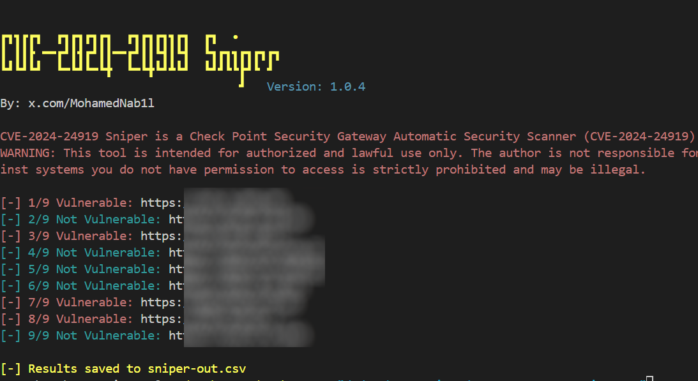

# CVE-2024-24919-Sniper



## Overview

CVE-2024-24919 Sniper is a Python script designed to scan for Check Point Security Gateway Information Disclosure vulnerabilities. This script can perform both single-target and bulk scanning, utilizing multithreading to improve scanning speed. It supports various command-line options to specify targets and control the scanning behavior.

## Features

- Scans and exploit CVE-2024-24919 vulnerability
- Supports single-target and bulk scanning
- Multithreaded scanning for improved performance
- Generates a CSV report with scan results
- ANSI color-coded output for better readability


## Installation

### Prerequisites

- Python 3.6+
- pip (Python package installer)

### Install Dependencies

1. **Clone the repository**:

    ```sh
    git clone https://github.com/yourusername/CVE-2024-24919-Sniper.git
    cd CVE-2024-24919-Sniper
    ```

2. **Install the required Python packages**:

    ```sh
    pip install -r requirements.txt
    ```

## Usage

### Command-Line Options

The script supports various command-line options to specify the target, mode, and other parameters.

- `-u`, `--url`: Target URL or IP address
- `-r`, `--remote-path`: Remote file path to read (default: `/etc/passwd`)
- `-f`, `--file`: File containing a list of target URLs or IPs (one per line)
- `-t`, `--threads`: Number of threads to use for scanning (default: 3)

### Examples

#### Single Target Scan

To scan a single target:

```sh
python3 cve-2024-24919-sniper.py -u TARGET-IP
```

### Bulk Scan

To scan multiple targets from a file:
```sh
python3 cve-2024-24919-sniper.py -f targets.txt
```

### Custom Number of Threads

To specify the number of threads:
```sh
python3 cve-2024-24919-sniper.py -f targets.txt -t 5
```

## Output Report

The script will generate a CSV report named `sniper-out.csv` containing the scan results with the following columns:

- Host
- Vulnerable
- Status
- Last Scan Date

## Handling Interruptions

You can stop the script at any time by pressing `Ctrl+C`. The script will handle the interruption gracefully and exit.

## Contact

For any questions or feedback, you can reach out to the author:

- Twitter: [@MohamedNab1l](https://x.com/MohamedNab1l)

## Disclaimer

This tool is intended only for educational and authorized testing purposes. Use it at your own risk. Do not scan or attack targets that you do not have explicit permission to test.

